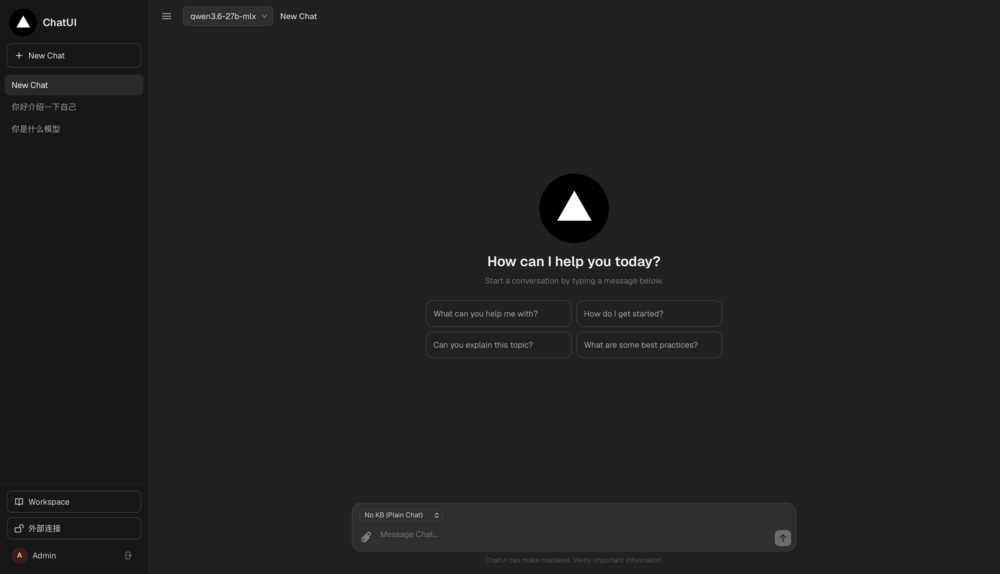
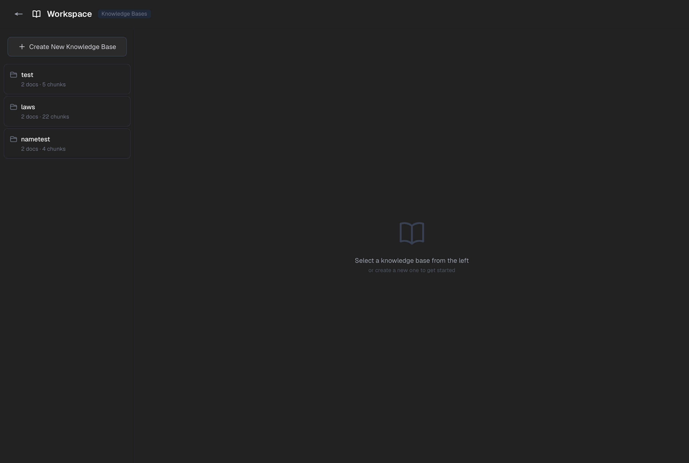
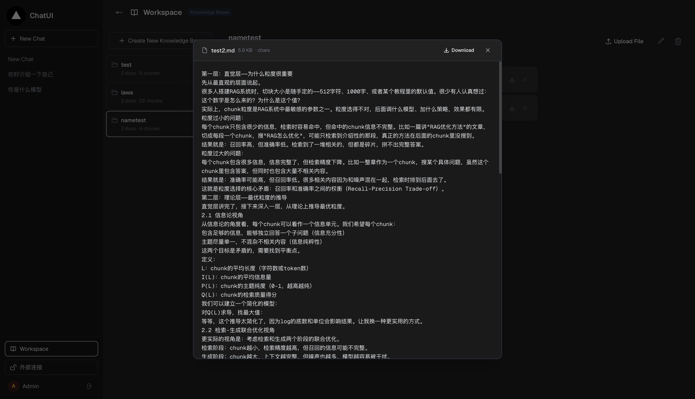
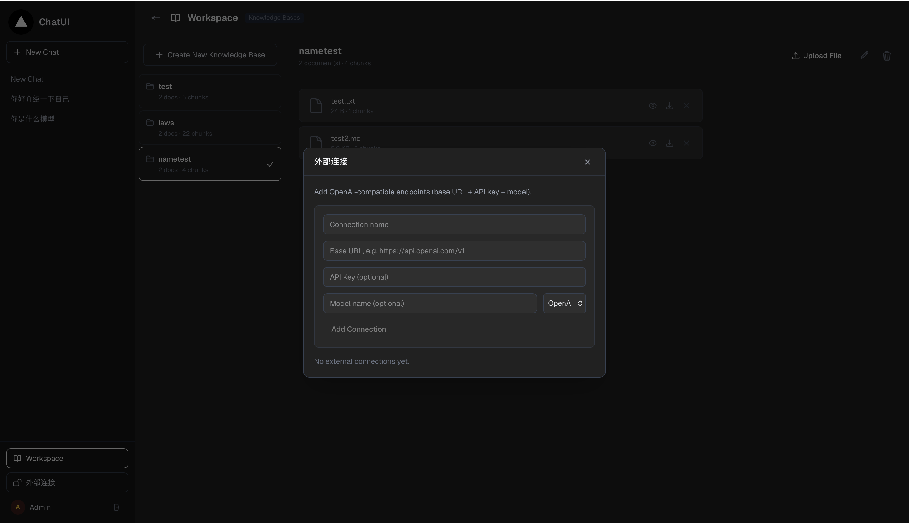

<div align="center">

# 🤖 ChatUI + RAG 企业文档知识库助手

**把你的文档变成一个"问不倒"的 AI 助手**

上传企业制度、项目资料、技术文档，用大白话提问，AI 就能给出**带出处的回答**。

全流程本地私有化部署，数据不出你的电脑。

[](https://nextjs.org)
[](https://fastapi.tiangolo.com)
[]()
[](./LICENSE)

</div>

---

## 👀 先看效果

<!-- 📸 截图方法：启动项目后截聊天界面、知识库页面，保存到 docs/images/ 文件夹，文件名对应下面即可 -->

| 💬 智能问答（带思考过程） | 📚 知识库管理 |
| :---: | :---: |
|  |  |

| 📄 文档预览与下载 | 🔌 外部模型连接 |
| :---: | :---: |
|  |  |

> 📌 图片位置已留好，把截图放到 `docs/images/` 文件夹、按上面的文件名命名，就会自动显示。

---

## ✨ 它能干什么

| 功能 | 说明 |
| --- | --- |
| 💬 **知识库问答** | 上传文档 → 自动解析入库 → 提问就答，回答基于你的文档，不瞎编 |
| 🧠 **思考过程展示** | 能看到 AI 检索了什么、怎么想的，回答可追溯 |
| 🔍 **混合检索** | 语义检索（懂意思）+ 关键词检索（抓重点），双保险找得准 |
| 🎯 **智能重排序** | 对找到的内容二次打分，只把最相关的喂给 AI |
| 📚 **多知识库** | 不同项目建不同知识库，文档可上传、预览、下载、删除 |
| 🔌 **灵活换模型** | 界面上直接配置切换 LLM，本地模型 / 云端 API 都行 |
| 🏠 **全本地部署** | 模型跑在自己机器上（LM Studio），隐私数据不出内网 |

---

## 🏗️ 系统架构

一句话：**浏览器问问题 → 前端转发 → 后端查文档 → 本地大模型组织答案 → 流式返回**。

```
┌──────────┐      ┌─────────────────┐      ┌──────────────────┐      ┌─────────────┐
│  浏览器   │ ───▶ │  ChatUI 前端     │ ───▶ │  rag-server 后端  │ ───▶ │  LM Studio  │
│  你在这里 │ ◀─── │  Next.js :3002  │ ◀─── │  FastAPI :8000   │ ◀─── │  模型 :1234 │
└──────────┘ SSE  │  聊天界面/管理    │ 代理  │  RAG检索/文档处理  │ API  │  LLM+向量化 │
                  └─────────────────┘      └──────────────────┘      └─────────────┘
```

**一次提问背后发生了什么（RAG 流程）：**

```
你的问题 ──▶ ① 向量化 ──▶ ② 在文档向量库里找相关片段 ──▶ ③ 混合检索+重排序
                                                        │
流式返回 ◀── ⑤ 本地大模型生成回答 ◀── ④ 把片段塞进提示词 ◀─┘
```

| 环节 | 用了什么 |
| --- | --- |
| 文档解析 | MarkItDown（PDF/Word/Markdown），RapidOCR 提取图片里的文字 |
| 内容清洗 | ftfy 编码修复 + 正则去噪 |
| 文本分块 | LangChain 两级切分（先按标题、再按 1000 字符，重叠 200） |
| 向量化 | BGE-M3 |
| 向量存储 | ChromaDB |
| 检索 | 语义检索 + BM25 关键词检索，RRF 融合 |
| 重排序 | bge-reranker-v2-m3（Cross-Encoder） |
| 生成 | Qwen（本地部署），SSE 流式输出 |

---

## 🛠️ 自己部署一套（保姆级教程）

整体分 **4 步**：装工具 → 部署后端 → 部署前端 → 开始使用。跟着做就行，卡住了看文末 FAQ。

### 第 0 步：你需要准备

| 需要什么 | 要求 |
| --- | --- |
| 电脑 | macOS / Windows / Linux 均可 |
| 内存 | 建议 16G 以上（跑本地 27B 模型建议 32G，内存小可以换小模型，见 FAQ） |
| 硬盘 | 至少 30G 空闲（模型文件比较大） |
| 网络 | 能下载模型（HuggingFace / ModelScope） |

### 第 1 步：安装基础工具

**Node.js（跑前端）**：去 [nodejs.org](https://nodejs.org) 下载 LTS 版本（18 以上），一路下一步。

**Python（跑后端）**：去 [python.org](https://www.python.org/downloads/) 下载 3.10+ 版本，安装时勾选 "Add to PATH"（Windows）。

**Git（拉代码）**：

```bash
# macOS（弹窗点安装即可）
xcode-select --install

# Windows：去 https://git-scm.com 下载
```

### 第 2 步：安装 LM Studio（本地模型服务）

1. 去 [lmstudio.ai](https://lmstudio.ai) 下载安装
2. 打开后点顶部 **Search**，下载两个模型：
   - **对话模型**：`Qwen` 系列（如 Qwen3 8B/14B，机器好可以上更大的）
   - **向量化模型**：`text-embedding-bge-m3`
3. 点左侧 **Developer** → 勾选两个模型 → 点 **Start Server**（默认端口 1234）

> 💡 这一步相当于给系统装上"大脑"。装好后可以打开 `http://localhost:1234` 确认服务已启动。

### 第 3 步：部署后端 rag-server

```bash
# 拉取后端代码（两个仓库都开源，直接克隆）
git clone https://github.com/X060416/rag-server.git
cd rag-server

# 创建虚拟环境并安装依赖
python3 -m venv venv
source venv/bin/activate        # Windows 用: venv\Scripts\activate
pip install -r requirements.txt

# 下载重排序模型（约 500MB，只需一次）
python download_model.py

# 启动！
python main.py
```

看到 `Starting RAG server on 0.0.0.0:8000` 就说明成功了。**保持这个终端窗口别关**。

> 📝 如果你的模型名和默认的不一样，改环境变量即可：
> `LM_STUDIO_LLM_MODEL`（对话模型名）、`LM_STUDIO_EMBEDDING_MODEL`（向量化模型名）

### 第 4 步：部署前端 ChatUI

**再开一个新终端**（后端那个别关）：

```bash
git clone https://github.com/X060416/chatui-rag.git
cd chatui-rag

npm install
npm run dev
```

浏览器打开终端提示的地址（默认 `http://localhost:3000`），看到聊天界面就大功告成了 🎉

### 第 5 步：开始使用

1. 进入**知识库**页面，新建一个知识库
2. 上传你的文档（PDF / Word / Markdown / TXT 都行）
3. 等状态变成"已完成"（系统正在解析、分块、向量化）
4. 回到聊天页，直接提问，比如："这份文档里关于 XX 是怎么规定的？"

---

## ❓ 常见问题

<details>
<summary><b>点开始对话没反应 / 报错连接失败？</b></summary>

按顺序检查三个服务是否都在跑：

1. LM Studio：打开 `http://localhost:1234`，有内容说明正常
2. 后端：那个终端窗口有没有报错？`http://localhost:8000` 能不能打开
3. 前端：`npm run dev` 的终端有没有报错
</details>

<details>
<summary><b>内存不够 / 电脑带不动大模型？</b></summary>

在 LM Studio 里换小一号的模型（如 Qwen3 4B / 8B），然后设置环境变量 `LM_STUDIO_LLM_MODEL=新模型名`，重启后端即可。检索质量不受影响（向量化和重排序模型很小）。
</details>

<details>
<summary><b>回答和文档内容对不上？</b></summary>

- 确认提问的知识库选对了
- 文档是否解析成功（知识库页面看文档状态）
- 尝试换一种问法，或多给几个关键词
</details>

<details>
<summary><b>支持哪些文档格式？</b></summary>

PDF、Word（docx）、Markdown、TXT、图片（自动 OCR 提取文字）。
</details>

<details>
<summary><b>每天开机后要怎么启动？</b></summary>

三步：① LM Studio 点 Start Server → ② 终端启动 rag-server（`python main.py`）→ ③ 终端启动前端（`npm run dev`）。
</details>

---

## 🧰 技术栈

| 层 | 技术 |
| --- | --- |
| 前端 | Next.js 16 · React 19 · TypeScript · Tailwind CSS |
| 后端 | Python · FastAPI · LangChain · ChromaDB · jieba + BM25Okapi |
| 模型 | Qwen（LLM）· BGE-M3（Embedding）· bge-reranker-v2-m3（Reranker）|

---

## 📄 License 与致谢

- 本项目基于开源项目 [ChatUI](https://github.com/imelanthirayan/ChatUI) 二次开发，遵循其 [MIT License](./LICENSE)
- RAG 后端服务也已开源：[rag-server](https://github.com/X060416/rag-server)，包含文档解析、混合检索、重排序等完整实现，可独立部署使用
